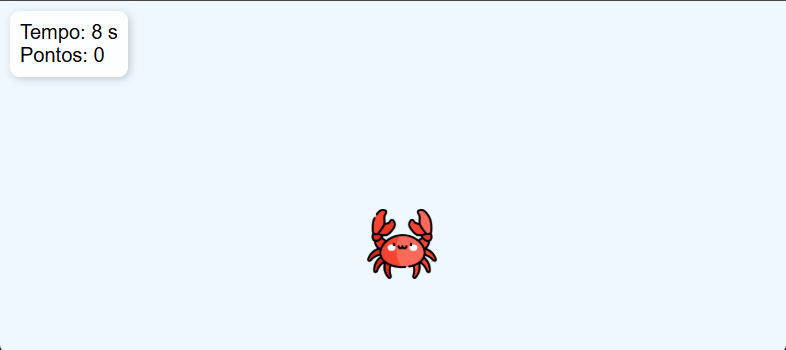

# 🐾 Jogo de Treinamento de Clique com Sons de Animais

Um jogo interativo e educativo feito para crianças pequenas aprenderem a usar o mouse de forma divertida!  
Ao clicar nos animais que aparecem na tela, eles somem, contam pontos e emitem sons reais.  
Ideal para crianças a partir de 4 anos!

## 🎯 Objetivo

- Estimular a coordenação motora e o raciocínio visual de crianças.
- Associar imagens de animais aos seus sons.
- Desenvolver familiaridade com o clique do mouse.

## 🧩 Funcionalidades

- Pontos gerados aleatoriamente na tela com imagens de animais.
- Ao clicar, o animal emite seu som correspondente.
- O som anterior para automaticamente ao clicar em um novo animal.
- Cronômetro de 60 segundos.
- Contador de pontos ao longo do tempo.
- Tela de fim de jogo com botão de reinício.
- Efeitos visuais e animações leves.

## 📸 Demonstração

 

## 🚀 Como Executar

1. Clone o repositório:
   ```bash
   git clone https://github.com/seu-usuario/jogo-clique-animais.git
   cd jogo-clique-animais
2. Adicione os arquivos de mídia:

3. Coloque as imagens dos animais na pasta images/

4. Coloque os sons dos animais na pasta sounds/

Exemplo de estrutura:

```
projeto/
├── index.html
├── images/
│   ├── cachorro.png
│   ├── gato.png
│   └── ...
└── sounds/
    ├── cachorro.mp3
    ├── gato.mp3
    ├── vitoria.mp3
    └── ...
```
Abra o index.html em um navegador moderno (Chrome, Firefox, Edge).
> O arquivo ja contem imagens e sons de animais para facilitar o uso


## 📚 Tecnologias Usadas
HTML5

CSS3

JavaScript Puro

## 🔊 Fontes de Sons Gratuitos
Você pode baixar sons reais e gratuitos de animais em:

[Pixabay Sounds](https://pixabay.com/sound-effects/)

## 💡 Melhorias Futuras
Modo touch para tablets.

Níveis de dificuldade (tempo reduzido, mais animais).

Sistema de ranking local.

Traduções para outros idiomas.

## 👶 Público-Alvo
Crianças de 3 a 6 anos.

Pais, professores e terapeutas que buscam atividades educativas.

## 📄 Licença
Este projeto está sob a licença MIT. Veja o arquivo LICENSE para mais detalhes.

> Desenvolvido com carinho para tornar o aprendizado mais divertido 🐶🦜🐷
